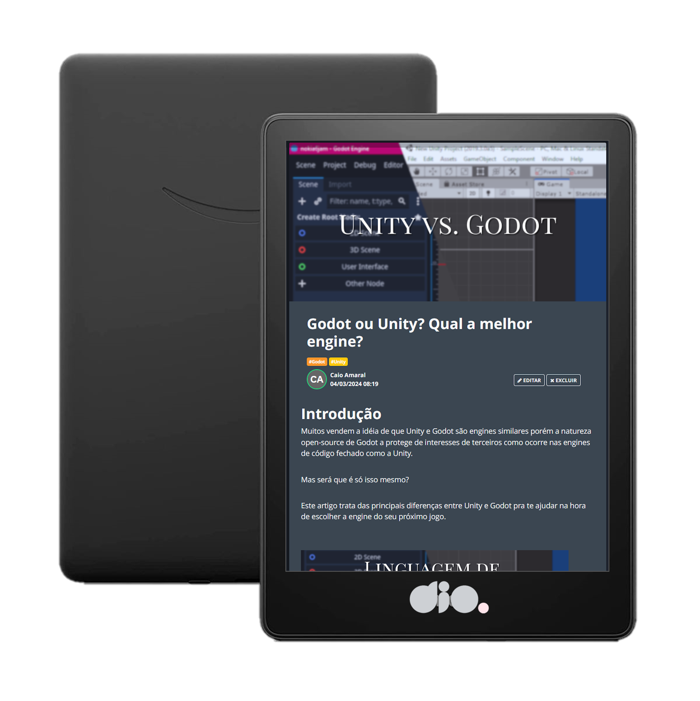

    

  
  

-------

  

# Projeto artigo técnico gerado por I.A.s

Projeto com o objetivo de gerar um artigo técnico com um layout rico, leitura agradável e com foco em promover sua autoridade técnica.

<a href="https://web.dio.me/articles/godot-ou-unity-qual-a-melhor-engine?back=%2Farticles&open-modal=true&page=1&order=oldest" title="View article now"> 📕Clique aqui para ler o artigo</a>

## 💻 Tecnologias utilizadas no projeto

- [ChatGPT](https://chat.openai.com/) - para título e conteúdo
- [Canva] (https://canva.com/) - para edição de imagens
- [Paint.NET] (https://www.getpaint.net/index.html) - para edição de imagens

## 📄 Prompts e ferramentas

ChatGPT：

|   Ação   | prompt                                                                                                                                                                                                                                                                         |
| :------: | ------------------------------------------------------------------------------------------------------------------------------------------------------------------------------------------------------------------------------------------------------------------------------ |
| conteúdo | Crie um artigo de até 5 seções sobre as diferenças principais diferenças entre Godot e Unity. {REGRAS}- não possuir mais do que 5 blocos de texto blocos em texto corrido trazer exemplos de código linguagem jovem mas respeitosa fazer call to action para as minhas redes sociais |

Paint.NET：

- No Paint.NET fiz uma montagem com dois prints sendo um de uma tela da Unity e outro sendo uma tela do Godot:

• Unity

• Godot

## ✨ Features

- Conteúdo gerado via ChatGPT

## 📚 Materiais

- prompts utilizados

## 🛠️ Instruções de execução

Utilize os prompts acima nas ferramentas sugeridas para gerar o material base e utilize uma ferramenta de edição de documentos como power point, libreoffice , indesign para diagramação, o passo a passo em vídeo pode ser conferido na plataforma da [DIO](https://dio.me).

## 👨‍💻 Aluno

    
    
&nbsp&nbsp&nbspCaio Amaral 
    &nbsp&nbsp&nbsp
    <a href="https://github.com/caiomga">
    GitHub</a>&nbsp;|&nbsp;
    <a href="www.linkedin.com/in/
caiomga">LinkedIn</a>
&nbsp;|

  

---

[Caio Amaral](https://github.com/caiomga)